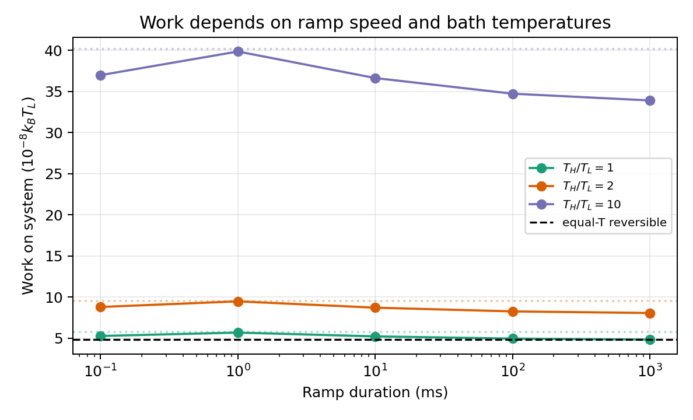
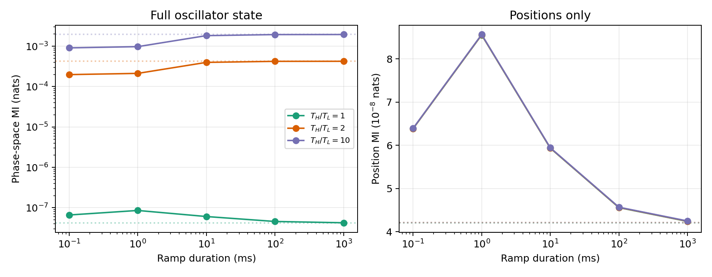
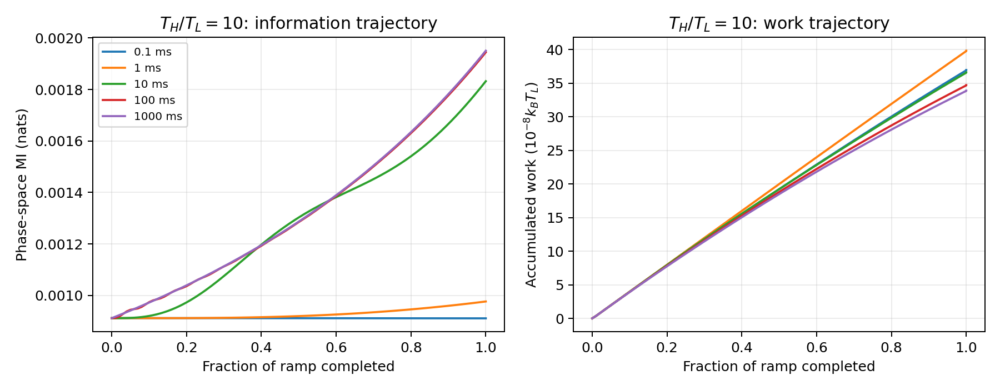

# Finite-time reduction of oscillator coupling

## Question and model

How do control work and dependence change when the coupling between two noisy oscillators is lowered from the equivalent of **85 Hz to 58 Hz**? I simulated the classical position-coupled model from the [oscillator note](coupled_oscillators.tex), using the corrected conversion from the [extensions note](theory_extensions.tex): $g/k=-2|\Lambda|/\omega_0$. The oscillators have frequency $\omega_0/2\pi=400$ kHz and damping rates $\gamma_1/2\pi=12$ Hz and $\gamma_2/2\pi=6$ Hz. The cold bath is at $T_L=300$ K; the hot-to-cold temperature ratio is 1, 2, or 10.

The stiffness matrix is $k\begin{pmatrix}1&g/k\\g/k&1\end{pmatrix}$. I start at the exact Gaussian steady state for 85 Hz, change the coupling linearly over the stated duration, and calculate work from

$$
\frac{W_{\rm on}}{k_BT_L}
=\int\langle u_1u_2\rangle\,d(g/k),
$$

where $u_i=x_i\sqrt{k/(k_BT_L)}$. The covariance evolves under the linear Langevin equation; each small constant-coupling interval is propagated analytically by a matrix exponential. An instantaneous change is included as a reference. This is **work done on the oscillator Hamiltonian by changing its coupling**, not the optical power required in the cited apparatus.

## Results

**Figure 1.** Work versus ramp duration. Dotted lines show the instantaneous-change value for each temperature ratio. The black dashed line is the equal-temperature reversible prediction, $k_BT_L\Delta I=4.826\times10^{-8}k_BT_L=2.00\times10^{-28}$ J. Positive work means energy is put into the oscillators. The 1 ms point is higher than adjacent points: underdamped motion makes the finite-time response nonmonotonic.

| $T_H/T_L$ | Instantaneous work | 1 ms | 10 ms | 1 s |
|---:|---:|---:|---:|---:|
| 1 | 5.738 | 5.692 | 5.231 | 4.842 |
| 2 | 9.563 | 9.486 | 8.718 | 8.070 |
| 10 | 40.163 | 39.841 | 36.615 | 33.895 |

All table entries are in $10^{-8}k_BT_L$. At equal temperatures, the 1 s ramp is within 0.34% of the reversible result; the instantaneous change takes about 19% more work. At $T_H/T_L=10$, the 1 s result is $1.40\times10^{-27}$ J, but there is no corresponding one-temperature free-energy prediction.

**Figure 2.** Information at the end of each ramp. Dotted lines mark the *final steady-state* values, reached only after the system is allowed to settle at 58 Hz. The left panel uses each oscillator's position and velocity; the right uses positions alone. At $T_H/T_L=10$, the steady-state full phase-space mutual information rises from $9.12\times10^{-4}$ to $1.95\times10^{-3}$ nats as coupling falls. Position-only information falls from $9.04\times10^{-8}$ to $4.21\times10^{-8}$ nats. The heat-current-related position-velocity correlation dominates the full measure, so the two measures move in opposite directions.

**Figure 3.** For $T_H/T_L=10$, slow ramps let the heat-current correlation grow during the change; fast ramps end before the state can respond much. Work accumulates in every ramp shown. These trajectories make clear why change in mutual information alone does not determine the control work in the driven steady state.

## Interpretation and limits

The model reproduces the equilibrium relation in its slow, equal-temperature limit. With unequal baths, lowering coupling can **increase full-state dependence while still requiring positive work**. Position-only dependence follows the equilibrium trend, but it is several orders of magnitude smaller than the heat-current-related dependence at the tested settings. The control work also grows with the hot-bath temperature because the oscillator fluctuations are larger.

These are model predictions, not measurements of the Yang *et al.* device. The model uses only a cross-stiffness term, whereas the experiment's optical spring also shifts individual mode frequencies. The bath temperature ratios are illustrative, and the calculated work excludes laser-drive energy and continuous heat used to maintain the two-temperature steady state. Comparing absolute work to the apparatus would require its calibrated control protocol and energy flows.

## Reproduce

Run `python source/finite_time_sweep.py` from the repository root. It writes the three PNG figures and [all numerical results](finite_time_results/results.csv). Dependencies are NumPy, SciPy, and Matplotlib. Doubling the coupling-ramp discretization from 400 to 800 intervals changed the $T_H/T_L=10$ work values by less than $10^{-5}$ relative across the five nonzero durations; the 1 s equal-temperature result also approaches the analytic reversible value.
