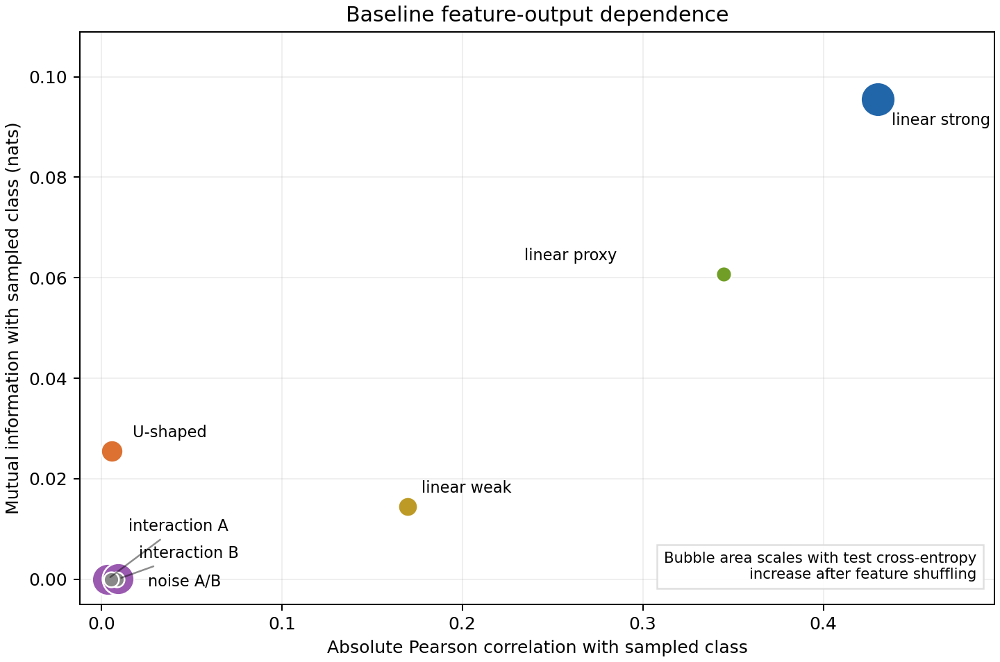
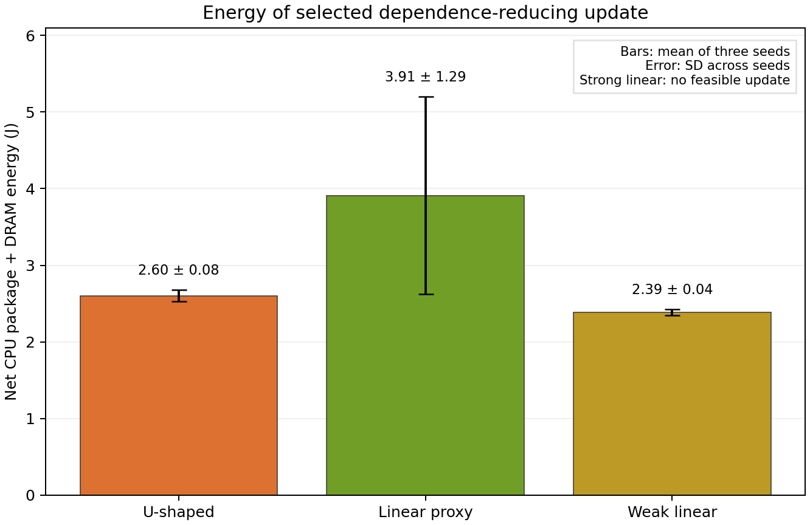

# Synthetic ReLU feature-dependence experiment

This experiment asks how much measured compute energy is needed to reduce a trained classifier's marginal dependence on one feature while preserving predictive performance. It compares that dependence with Pearson correlation and permutation loss. The [experiment code](../../relu_feature_dependence_experiment.py), [aggregate data](aggregate.csv), and [plotting code](../../plot_relu_dependence_results.py) reproduce the results below.

## Data-generating process

Each observation has eight features. $X_0,X_3,X_4,X_5,X_6,X_7$ are independent, equiprobable values in $\{-1,1\}$. The U-shaped feature has $P(X_1=-1)=P(X_1=1)=1/4$ and $P(X_1=0)=1/2$. The proxy is $X_2=X_0 S$, where $S$ is independent of the other variables, $P(S=1)=0.9$, and $P(S=-1)=0.1$. Thus $X_2$ is a noisy copy of $X_0$. The response is drawn independently conditional on the features:

$$
Y\mid X\sim\operatorname{Bernoulli}(\sigma(g(X))),\qquad
g(X)=1.4X_0+1.5(|X_1|-0.5)+1.3X_3X_4+0.6X_5,
\qquad \sigma(t)=\frac{1}{1+e^{-t}}.
$$

The roles are strong linear ($X_0$), U-shaped ($X_1$), linear proxy ($X_2$), interaction pair ($X_3,X_4$), weak linear ($X_5$), and noise ($X_6,X_7$). The proxy is correlated with a predictor in the response equation but does not appear in $g$. Each interaction feature is useful jointly with its partner even though its own marginal association with $Y$ is approximately zero.

For each of the three seeds 2026, 2027, and 2028, the code generates independent training, validation, and test sets of 12,000, 12,000, and 20,000 observations. Within a run, their random seeds are respectively $s$, $s+1$, and $s+2$.

## Classifier and dependence measures

The classifier is an $8\to32\to16\to1$ fully connected ReLU network. Its final logit $f_\theta(X)$ gives $p_\theta(X)=\sigma(f_\theta(X))$. Baseline training uses full-batch Adam for 250 steps, learning rate 0.015, weight decay $10^{-4}$, and binary cross-entropy. PyTorch uses two CPU threads. Mean baseline test accuracy after thresholding $p_\theta$ at 0.5 is approximately 78.7%.

The dependence variable is the **sampled classifier class** $C\mid X\sim\operatorname{Bernoulli}(p_\theta(X))$. This definition retains the model's probabilities. It is distinct from the hard class used for accuracy. For a discrete feature $A=X_j$, let $w_a=P(A=a)$, $q_a=E[p_\theta(X)\mid A=a]$, and $q=E[p_\theta(X)]$. In the experiment these are empirical averages over a data split. The joint-to-product ratio and its average log are

$$
R_j(a,c)=\frac{P(A=a,C=c)}{P(A=a)P(C=c)},\qquad
R_j(a,1)=\frac{q_a}{q},\qquad
R_j(a,0)=\frac{1-q_a}{1-q},
$$

$$
I_j=I(X_j;C)
=\sum_a w_a\left[
q_a\log\frac{q_a}{q}
+(1-q_a)\log\frac{1-q_a}{1-q}
\right].
$$

Logs are natural, so $I_j$ is in nats. The comparison statistic is the absolute Pearson correlation $|\operatorname{corr}(X_j,C)|$. Both are marginal statistics: they do not measure the dependence of $C$ on a pair such as $(X_3,X_4)$. The code evaluates the formulas from predicted probabilities, avoiding Monte Carlo draws of $C$.

As another measure of prediction reliance, the experiment independently shuffles each feature across test examples and reports the change in test binary cross-entropy,

$$
\Delta L_j^{\mathrm{shuffle}}
=L_{\mathrm{test}}(X_{\setminus j},\widetilde X_j;Y)
-L_{\mathrm{test}}(X;Y).
$$

Shuffling can create feature combinations absent from the original joint distribution, particularly for the proxy, so this is a diagnostic rather than a causal effect.

## Dependence-reducing update and energy boundary

For each feature, the code starts from a separate copy of the same trained baseline and fine-tunes it with

$$
\mathcal L_{\lambda,j}(\theta)
=L_{\mathrm{train}}(\theta)+\lambda I_{\mathrm{train}}(X_j;C_\theta),
\qquad
\lambda\in\{0.1,0.3,1,3,10\}.
$$

Fine-tuning uses full-batch Adam, learning rate 0.006, and weight decay $10^{-4}$. Validation is checked every 10 steps through step 100. A candidate succeeds at its first check satisfying **both**

$$
I_{\mathrm{val},j}^{\mathrm{new}}\leq 0.5I_{\mathrm{val},j}^{\mathrm{base}},
\qquad
L_{\mathrm{val}}^{\mathrm{new}}\leq L_{\mathrm{val}}^{\mathrm{base}}+0.015
\quad\text{nats}.
$$

The selected candidate uses the fewest steps among successful penalties, breaking ties by validation cross-entropy. A feature with baseline validation $I_j<0.002$ nats is skipped because halving such a small marginal value is not a useful target. A reported failure means only that this penalty grid and 100-step protocol found no candidate meeting both validation limits.

For a selected update, the experiment replays its fixed penalty and step count 12 times from the baseline weights. On Windows, it reads the Intel RAPL package and DRAM energy counters before and after each replay. Their picowatt-hour values are converted to joules with $3.6\times10^{-9}$ joules per picowatt-hour, as specified by the [Windows energy-meter interface](https://learn.microsoft.com/en-us/windows-hardware/drivers/powermeter/energy-meter-interface). A four-second idle measurement estimates background power $P_{\mathrm{idle}}$. The reported energy for a replay is

$$
E_{\mathrm{update}}
=\Delta E_{\mathrm{package}}+\Delta E_{\mathrm{DRAM}}
-P_{\mathrm{idle}}\,t_{\mathrm{update}}.
$$

Each seed's value is the mean of its 12 replays; the uncertainty below is the standard deviation of the **three seed means**, not the within-seed replay variation. This boundary covers the selected CPU update. It excludes baseline training, candidate search, inference, and components outside the package and DRAM counters.

## Held-out results

All dependence, correlation, shuffling, and post-update values are evaluated on the untouched test set. Values in the table are means over the three seeds. Energy is in joules and the ± value is the standard deviation across seeds.

<table>
<thead>
<tr><th>Feature</th><th>Baseline MI (nats)</th><th>|Pearson r|</th><th>Shuffling loss increase (nats)</th><th>Selected update</th></tr>
</thead>
<tbody>
<tr><td>Strong linear</td><td>0.0956</td><td>0.430</td><td>0.320</td><td>No candidate met both limits</td></tr>
<tr><td>U-shaped</td><td>0.0256</td><td>0.0058</td><td>0.088</td><td>10 steps; 2.60 ± 0.08 J</td></tr>
<tr><td>Linear proxy</td><td>0.0607</td><td>0.345</td><td>0.007</td><td>10–20 steps; 3.91 ± 1.29 J</td></tr>
<tr><td>Interaction A</td><td>&lt;0.0001</td><td>0.0034</td><td>0.259</td><td>Below marginal MI threshold</td></tr>
<tr><td>Interaction B</td><td>&lt;0.0001</td><td>0.0093</td><td>0.260</td><td>Below marginal MI threshold</td></tr>
<tr><td>Weak linear</td><td>0.0145</td><td>0.170</td><td>0.052</td><td>10 steps; 2.39 ± 0.04 J</td></tr>
<tr><td>Noise A</td><td>&lt;0.0001</td><td>0.0086</td><td>−0.0006</td><td>Below marginal MI threshold</td></tr>
<tr><td>Noise B</td><td>&lt;0.0001</td><td>0.0053</td><td>−0.0001</td><td>Below marginal MI threshold</td></tr>
</tbody>
</table>

*Baseline dependence. Bubble area reflects the test loss increase after shuffling a feature. The U-shaped feature separates MI from linear correlation; the interaction pair has large shuffling effects near the origin.*

*Energy for selected successful updates. The strong linear feature has no bar because none of the tested updates met both validation limits.*

On the test set, the successful updates reduced MI to 0.0105 nats for the U-shaped feature, 0.0256 for the proxy, and 0.0036 for the weak linear feature. Their respective mean test cross-entropy increases were 0.0055, 0.0130, and 0.0069 nats. One proxy run exceeded the validation-selected 0.015-nat tolerance on the test set by 0.0006 nats.

The U-shaped feature has appreciable $I(X_1;C)$ with near-zero linear correlation. Each interaction feature has near-zero **marginal** MI and correlation but shuffling either raises test loss by about 0.26 nats. The proxy has substantial marginal MI due partly to its connection with $X_0$, while its own shuffling loss is small.

## Interpretation and limitations

The measured joules are implementation-specific CPU update costs, not thermodynamic minima or a universal energy-per-nat coefficient. Selected updates last only about 0.04–0.08 seconds, so idle subtraction and counter timing affect the values. Three synthetic seeds are too few for a reliable energy ranking. The strong feature's failure is a statement about this constrained update procedure, not proof that reducing its dependence while preserving performance is impossible.

## Reproduction

Install NumPy, PyTorch, Matplotlib, and pywin32 in a Python environment on a Windows machine exposing the RAPL package and DRAM counters. From the repository root, run:

~~~powershell
python source/relu_feature_dependence_experiment.py --seed 2026 --outdir source/data/relu_dependence/seed_2026
python source/relu_feature_dependence_experiment.py --seed 2027 --outdir source/data/relu_dependence/seed_2027
python source/relu_feature_dependence_experiment.py --seed 2028 --outdir source/data/relu_dependence/seed_2028
python source/plot_relu_dependence_results.py
~~~

Each seed directory contains [feature results](seed_2026/features.csv), [all penalty candidates](seed_2026/candidates.csv), a [configuration and metrics summary](seed_2026/summary.json), and a baseline model checkpoint. The [aggregate CSV](aggregate.csv) is the three-seed summary read by the plotting script. Running the seed jobs again does not automatically rebuild that CSV; it is provided with these experiment outputs.
